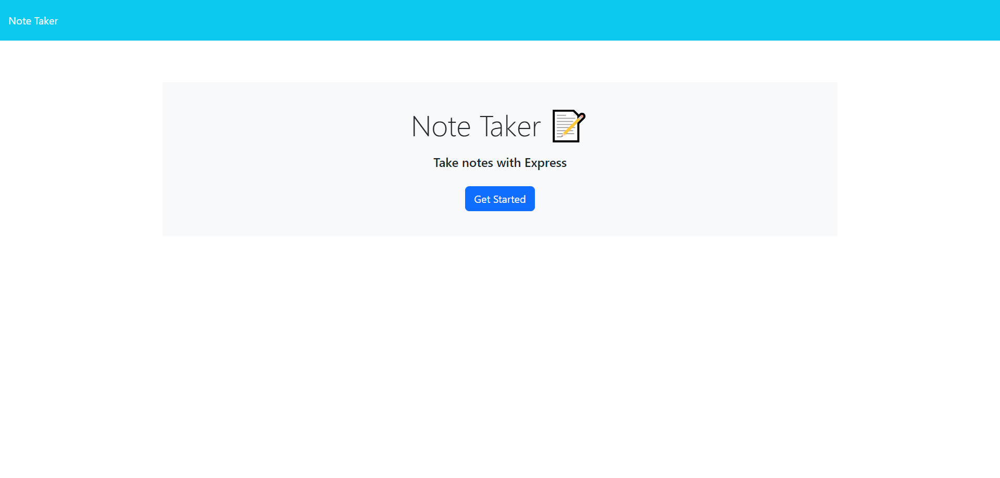
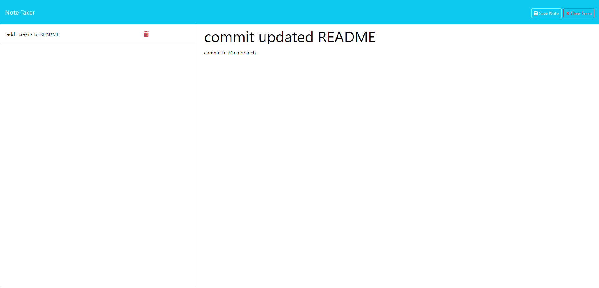

# NOTE TAKER SERVER

# Intro
The Note Taker Server is a server provided for a simple note taking website. Instead of sending notes to local storage, Expressjs is used to store the local files to a server and update the website with a JSON file.

# Installation
The server is deployed using Render, so there is no need to use an independant device; however, these are the instructions for deploying it independant of Render: 
- Type `npm i` in terminal
- Type either `npm start server.js` or `node server.js` to run on localhost:3001.

# Usage 
- Upon loading the index page, click `Get Started`
- Click inside of the input field `Note Title` and enter a note title
- Click inside of the input field `Note Text` and enter a note.
- Click the button `Save Note` to save the note or `Clear Form` to erase it.

# Live URLs
[Github Repo](https://github.com/aharper2568/note-taker-server)\
[Live Render URL](https://note-taker-server-9tay.onrender.com/)

# Screenshots 

# Author

Developed in VSCode by **Anthony Harper**